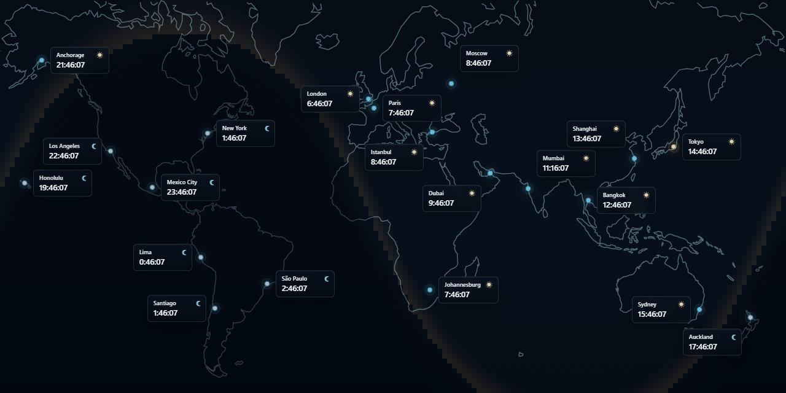

[简体中文](../../README.md) | [繁體中文](README.zh-Hant.md) | [English](README.en.md) | [日本語](README.ja.md) | [한국어](README.ko.md) | [Español](README.es.md) | [Русский](README.ru.md) | [Português](README.pt.md) | Deutsch

# World Clock Timezone Map Wallpaper

Eine Weltzeituhr für Wallpaper Engine, die Ortszeiten, Tag und Nacht sowie den aktuellen Sonnen-Terminator auf einer Mercator-Weltkarte darstellt.



## Implementierte Funktionen

- Weltzeiten und Tag-Nacht-Grenze in Echtzeit
- IANA-Zeitzonen und Sommerzeit
- Eigene, voreingestellte und per JSON definierte Städte
- Atlantik- und Pazifik-zentrierte Kartenansicht
- Neun Oberflächensprachen

## Installation

[Steam Workshop](https://steamcommunity.com/sharedfiles/filedetails/?id=3747734053)

## Verwendung

Manuell hinzugefügte Zeitzonen müssen in der [Städteliste von IANA](https://data.iana.org/time-zones/tzdb-2026b/zone.tab) enthalten sein. Dieses Projekt verwendet die IANA-Version 2026b.

### Eigene Stadt einstellen

Für Peking werden in den Wallpaper-Engine-Einstellungen folgende Werte eingetragen:

| Einstellung | Wert |
| --- | --- |
| Eigene Zeitzone | `Asia/Shanghai` |
| Eigene Stadt | `Peking` |
| Eigene Koordinaten | `39.9042,116.4074` |

Koordinaten verwenden das Format `Breitengrad,Längengrad`. Für Süden und Westen werden negative Werte verwendet. IANA führt keine eigene Zeitzone für Peking, daher wird `Asia/Shanghai` verwendet.

### Benutzerdefinierte Städte hinzufügen

„Mehr Städte (s. Workshop-Beschreibung)“ akzeptiert ein oder mehrere Stadtobjekte. Die eckigen Klammern des Arrays können weggelassen werden.

#### Alle Stadtdaten angeben

Am Beispiel Mumbai werden Zeitzone, Name und Koordinaten angegeben:

```json
{"timeZone":"Asia/Kolkata","name":"Mumbai","lat":19.076,"lon":72.8777}
```

#### Nur die Zeitzone angeben

Am Beispiel Dublin wird nur die IANA-Zeitzone angegeben. Stadtname und Koordinaten werden automatisch ergänzt:

```json
{"timeZone":"Europe/Dublin"}
```

`timeZone` ist erforderlich; `name`, `lat` und `lon` sind optional.

#### Mehrere Städte hinzufügen

Stadtobjekte werden durch Kommas getrennt:

```json
{"timeZone": "Pacific/Honolulu"},
{"timeZone": "America/Anchorage"},
{"timeZone": "America/Los_Angeles"},
{"timeZone": "America/Mexico_City"},
{"timeZone": "America/New_York"},

{"timeZone": "Europe/London"},
{"timeZone": "Europe/Paris"},
{"timeZone": "Europe/Istanbul"},
{"timeZone": "Europe/Moscow"},
{"timeZone": "Asia/Dubai"},
{"timeZone":"Asia/Kolkata","name":"Mumbai","lat":19.076,"lon":72.8777},
{"timeZone": "Asia/Bangkok"},
{"timeZone":"Asia/Shanghai","name":"Peking","lat":39.9042,"lon":116.4074},

{"timeZone": "America/Sao_Paulo"},
{"timeZone": "America/Lima"},
{"timeZone": "America/Santiago"},

{"timeZone": "Africa/Johannesburg"},
{"timeZone": "Australia/Sydney"},
{"timeZone": "Pacific/Auckland"},
```
